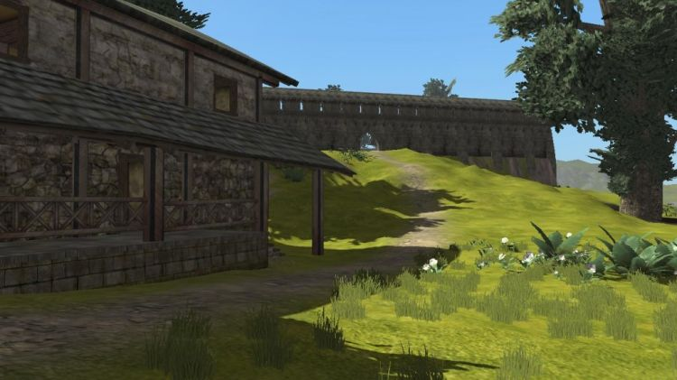

[Cyphesis](http://worldforge.org/dev/eng/servers/cyphesis) version 0.6.2 has been released and is now available from the WorldForge [download site](https://sourceforge.net/projects/worldforge/files/).

Cyphesis is a small to medium scale server for WorldForge games, with builtin AI. This version includes the demo game [Mason](http://worldforge.org/games/mason) which is currently in development. This release is intended for server administrators wishing to run a Mason server and World developers developing new worlds or game systems. It is primarily a bugfix release which fixes a serious crash issue.

Major changes in this version:

*   Fix for a possible crash related to wielded entities and destruction.
*   Addition of a new “spawner” property

Source code can be downloaded from here:

[Source Code tar.bz2](http://downloads.sourceforge.net/worldforge/cyphesis-0.6.2.tar.bz2)