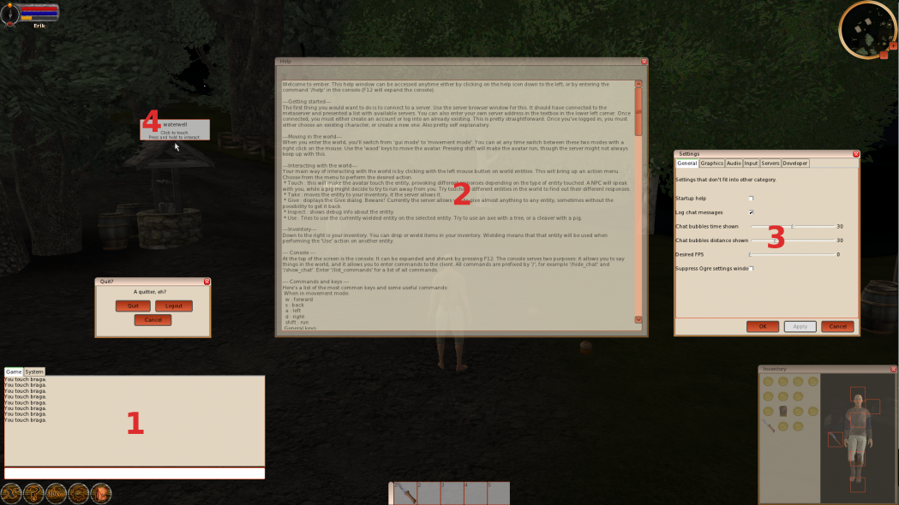

### #1 - Main Command and Information Window
This window is always present on the screen and provides a primary source of game and system information, the lower section of the window can be used to enter text commands. All game actions including those provided by the graphical user interface can be submitted to the client and server via text commands in this way. The game tab filters messages to those which relate to game play events sent to and from the server. The system tab provides more technical information that is normally not important to typical players but might be useful to developers or world builders.


### #2 - Help Window Help Icon
The help window provides information on the most common gameplay commands users will want to make use of. You can access the help window by clicking the question mark icon located in the toolbar on the bottom left corner of the screen.


### #3 - Client Settings Window Settings Icon
The Ember client can be customized in a variety of ways that goes beyond the scope of this page, but it is a good starting point for users seeking to improve performance or change the level of information that is being presented by default. Changes made in this window that are applied will be saved to the default Ember configuration file. While it is possible to edit that file directly it is not recommended.

### #4 - Cursor Feedback
When in interactive mode and hovering the arrow cursor over an object in the game world it will pop-up an information window that provides you with the name of the object in question and give a suggestion for how to further interact with that object.

#### Switching between Interaction and Movement Mode



Navigating and interacting with the world is done in one of two primary modes. Users can switch between interaction or movement modes using the right mouse button or while in the interaction mode left clicking on the mode icons you see represented here. It is important to note that when in the interaction mode it is still possible to move around the world using the "Move to" option in the input dialogue list.

#### Movement Mode Details



Movement mode allow you to drive yourself around the world. You can do this using the WASD keys or by holding the left mouse button and steering the character using the mouse. You will normally walk in movement mode, but you can also run by holding down the left shift key. When not moving about you can look freely around your area with the mouse.



#### Quit or Logout

If you would like to quit Ember or logout from the current game world click on the X icon in the bottom left corner of the screen and you will be presented with a dialogue asking which choice you wish to make. Use Logout if you simply wish to chance characters or world servers.

#### Inventory Pack


The inventory can be accessed by pressing the I key, or clicking on the pack icon in the tool bar at the bottom left part of the screen. The inventory has two sections of interest. The section denoted by the red letter A shows the contents of the pack and represents the bulk of the characters inventory. The other section denoted by the red letter B shows the slow which can be equipped. To move items around in the pack or equip them to the character just drag and drop them. You can also drag and drop items from any inventory space into the action bar or the world. When you drop an item into the world it should appear at the characters feet.

#### Quick Action Bar


Items placed in quick action bar can be quickly swapped between using the number representing that slot. The item in question will be equipped to the right hand and be usable for actions in the world. This is primarily used for weapons and tools, but any item from the inventory can be placed there.

#### Mini-map and Compass


The mini-map located in the upper right corner of the screen provides an adjustable overhead view of world surrounding the character. You can zoom the range of the view using the plus and minus buttons while in the interactive cursor mode. The character indicator in the center of the view rotates showing the characters compass heading, the world map remains fixed so you can always determine north.

#### Character Status

The character status bars in the upper left corner of the screen provides visual indicators for the main statistics. 

